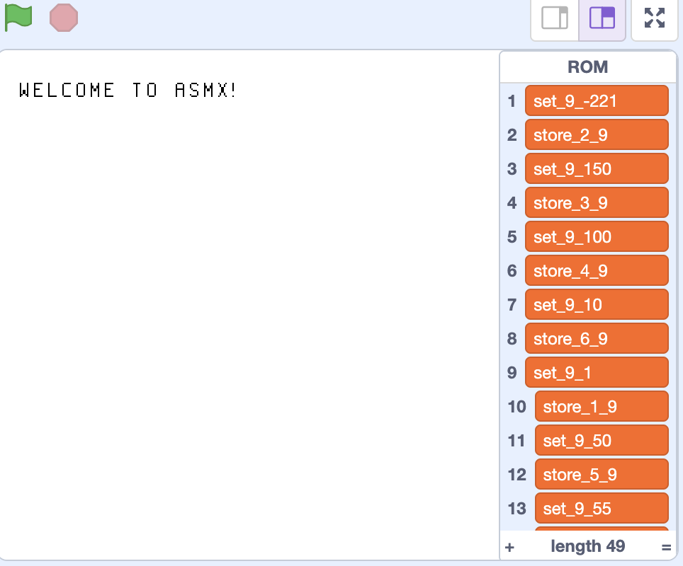

# 6. Arithmetic
Now we have the boring stuff out of the way, we can start learning some important instructions, and you can start writing your own code! The first instructions to learn are arithmetic (maths). The ASMX VM supports only basic Maths operations currently, these being the 4 operations. These are the 5 instructions you will need to know for this chapter:

```asm
; These are all instruction references, they're now coming into use.
SET [r] [i]
ADD [r] [ri]
SUB [r] [ri]
MUL [r] [ri]
DIV [r] [ri]
```

Each operation is fairly similar, apart from `SET`.

## SET
The `SET` command will set `[r]` to `[i]`.

```asm
SET u1 #13 ; Sets register u1 to have the value of 13
```

## ADD
The `ADD` command will set `[r]` to `[r]` plus `[ri]`.

```asm
ADD u1 #10 ; u1 = u1 + 10
ADD u2 u3  ; u2 = u2 + u3
```

## SUB
The `SUB` command will set `[r]` to `[r]` minus `[ri]`.

```asm
SUB u1 #10 ; u1 = u1 - 10
SUB u2 u3  ; u2 = u2 - u3
```

## MUL
The `MUL` command will set `[r]` to `[r]` times `[ri]`.

```asm
MUL u1 #10 ; u1 = u1 * 10
MUL u2 u3  ; u2 = u2 * u3
```


## DIV
The `DIV` command will set `[r]` to `[r]` divided by `[ri]`.

```asm
DIV u1 #10 ; u1 = u1 / 10
DIV u2 u3  ; u2 = u2 / u3
```

## Your first program!
Okay, I think you finally know enough to write your first piece of ASMX assembly code (if you haven't done so already). We're going to write a simple program that adds two numbers together, and stores it in a register, let's say `u1`. Let's break down what the program needs to do:

- Set two registers to numbers of your choice.
- Add the two registers.
- Store the result in `u1`.

I want you to try this by yourself. Open up a Text Editor. It really doesn't matter which, it could be as simple as Notepad, or as complex as Vim. Use the Instruction references and descriptions above to try and make your program. This is what I came up with:

```asm
SET u1 #10 ; Set the u1 register to 10.
SET u2 #20 ; Set the u2 register to 20.
ADD u1 u2 ; u1 = u1 + u2 (10 + 20)
```

## How to assemble your program
Before we run our code on the VM, we need to assemble it, which will turn our assembly into machine code that the VM can understand. Open up a Terminal, and run `asmx <your_file> <output_file>`, replacing `<your_file>` with the name of your file, and `<output_file>` with the name of the file that will be the result of the assembler. By running this, you should get a result that will look something like this:

```asm
set_1_10
set_2_20
add_1_2
```

This is ASMX VM Machine Code. The first thing you will probably notice is that the machine code is not that far off our assembly code, and that is because the Machine Code was designed to map very closely to the ASMX assembly language. You'll also notice that the Machine Code is not in binary. This is because Scratch does not understand binary, so we use base-10 instead, which helps make it more readable.

---

Next, we must load our Machine Code into the VM. Go to Scratch, and open up your VM project (if you don't have it, click [here](Getting Setup.md)). Go to the "Lists" section in the Block Palette and make sure that the "ROM" List is ticked. You'll see something like this:



ROM is an acronym for Read-Only Memory, and it is the list where our Machine Code instructions are stored. You will notice that there are already machine code instructions in there. That is because the default "Welcome to ASMX!" program is loaded. You can disregard that. Right clicking on the list will bring up a menu, you want to click "import".


Once you have clicked on "import", navigate to your machine code file, and select it. You will see that the old default program has been erase and your new machine code is in there. Now, let's check if our program works. Since we are using registers, we want to open up the registers list. If you saved your result in `u1` like I did, then you should see the result of the addition in item 1 of your list.


In my program, I added 10 and 20, and you can see in `u1` that I got the result of 30. Congratulations on running your first program! As we learn more instructions, we will be able to build much cooler programs than this. The keen-eyed among you might have noticed something odd about the registers list. If there are only 8 registers, then why are there 12 items in the registers list? Well, that's because I lied. There are technically 12 registers, however the last 4 registers are called **autoregisters**. Autoregisters are an advanced topic that I'll talk about later, but effectively, they are reserved registers that the assembler needs to function properly. We built 12 registers in total, but 8 of them are reserved for the user (that is what the u means in front of the registers), and 4 of them are reserved for the assembler. The user is not allowed to use the autoregisters, only the assembler. As you learn more about how the VM and Assembler work, you'll learn why the assembler even needs its own registers in the first place.