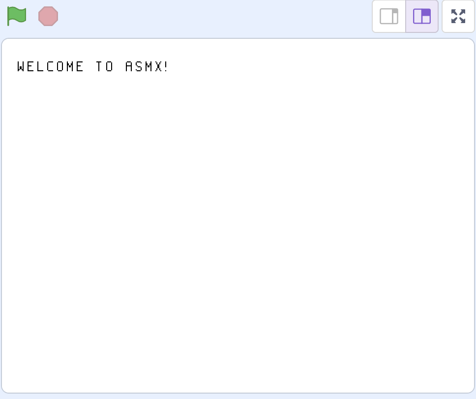

# 1. Getting Setup
Welcome to the first chapter in the guide, getting setup! Don't worry if you have no experience in low-level programming, or you don't know what a VM or Assembler is, that will be explained in the next chapter. You've already downloaded the ASMX assembler if you are reading this, so all that is missing is the ASMX Virtual Machine.

---

## Download The Virtual Machine
To download a copy of the ASMX Virtual Machine (VM for short), go to the [releases](https://github.com/cousdev/asmx/releases) page on the ASMX GitHub repository, and download the ASMX_VM.sb3 file (not the assembler). Once you have that file, you will need to import it into Scratch. 

## Importing the VM

In "My Stuff", click "New Project", then navigate to the "File" menu (at the top of the webpage), and select "Load from your computer". Navigate to the ASMX_VM.sb3 file, and the project should open up.

## Test the VM
When you press the Green Flag button, you should see the text "Welcome to ASMX!" on the screen (as seen below). If you see that text, congratulations, your Virtual Machine is working! If you don't ask for help in the Issues page on GitHub, somebody will help you out.

